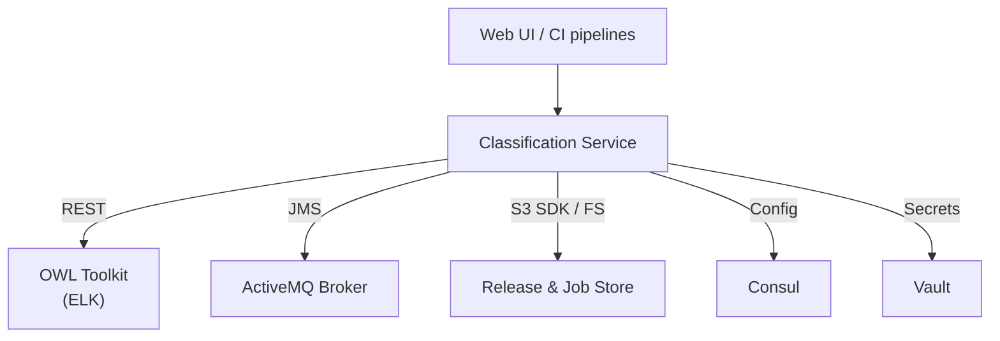
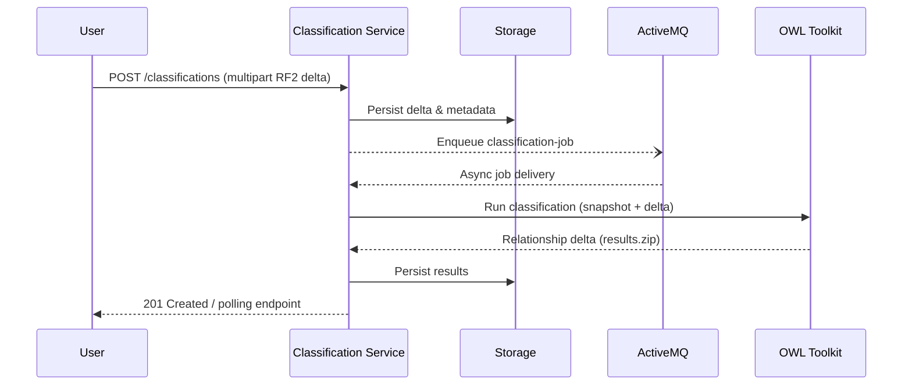

# SNOMED Classification Service (CS)

The **SNOMED Classification Service (CS)** is a Spring Boot–based, stateless web application that performs OWL-based **classification of SNOMED CT ontologies**. It accepts RF2 delta change-sets, runs an embedded reasoner (ELK by default) and produces an RF2 delta of inferred relationship changes ready for import back into a terminology server such as **Snowstorm**. 

CS integrates with **ActiveMQ**, **AWS S3 / local file-system storage**, **Consul** and **Vault**, while exposing a **REST API** documented via Swagger-UI.

---

## 1  High-Level Architecture



<br/>

#### Typical Classification Workflow



Key points:
* **Stateless** – all state lives in S3 or the local file-system allowing horizontal scalability.
* **Spring JMS & Async Executors** power distributed job processing and notifications.
* Packaged both as a **fat JAR** and a Debian **.deb** (for `supervisord`-based deployments).

---

## 2  Feature Highlights

* **Interactive Swagger-UI / OpenAPI 3 docs** – see `SwaggerConfig.java`.
* **Simple Basic-Auth security** enabled by default (overridable / extendable).
* **Distributed Classification Pipeline**
  * Job producer – `ClassificationController` (REST)
  * Worker – `ClassificationJobManager` (JMS listener)
* **JMS messaging (ActiveMQ)** – queue configured via `classification.jms.job.queue`; prefetch size tuned for scale.
* **Pluggable storage layer** (local FS or S3) unified via `ResourceManager`.
* **Consul & Vault support** for distributed configuration and secrets.
* **Configurable reasoner implementation** – default `ELK`, switchable via REST parameter.

---

## 3  Project Layout

```
src/
  main/
    java/org/snomed/otf/reasoner/server   ← Java sources
    resources/                            ← configuration, logback, etc.
  test/                                   ← unit & integration tests
```

Package conventions:
* `configuration`       Spring `@Configuration` classes & beans
* `rest`                Spring MVC controllers / DTOs
* `service`             Business logic & integration code
* `pojo`                Immutable POJOs & enums used in the API

---

## 4  Getting Started Locally

### 4.1  Prerequisites

1. **JDK 17**
2. **Maven 3.8+** (wrapper provided)
3. **ActiveMQ 5.x** – an embedded broker is started by default, but an external one is recommended for multi-instance testing.
4. (Optional) **AWS S3**, **Consul** & **Vault** if you want to mirror production setups.

> Tip: A `docker-compose.yml` bundling CS + ActiveMQ is included for quick startup.

### 4.2  Clone & Build

```bash
git clone https://github.com/IHTSDO/classification-service.git
cd classification-service
./mvnw clean verify
```

* `verify` runs the test-suite and produces `target/classification-service-${VERSION}.jar`.
* Run `./mvnw -Pdeb package` to additionally create `target/classification-service-${VERSION}-all.deb`.

### 4.3  Configuration

1. Copy `src/main/resources/application.properties` to `src/main/resources/application-local.properties` (already `.gitignored`).
2. Override at least the following properties:
   ```properties
   spring.security.user.name=<username>
   spring.security.user.password=<pwd>
   # --- Storage Locations ---
   snomed.release.storage.local.path=store/releases
   classification.job.storage.local.path=store/classifications
   # --- ActiveMQ ---
   spring.activemq.broker-url=tcp://localhost:61616
   classification.jms.job.queue=classification-jobs
   ```
3. Any property can also be supplied via environment variables, e.g. `SPRING_ACTIVEMQ_BROKER_URL`.

### 4.4  Run

```bash
java -Xms1g -Xmx4g \
     -jar target/classification-service-${VERSION}.jar \
     --server.port=8089 \
     --server.servlet.contextPath=/classification-service \
     --spring.config.additional-location=classpath:/,file:./ \
     --spring.profiles.active=local
```

Swagger UI will be available at <http://localhost:8089/classification-service/swagger-ui/index.html>.

---

## 5  Messaging & Async Workflows

* Classification jobs are published to **`${classification.jms.job.queue}`**.
* Prefetch size can be tuned via `spring.activemq.queuePrefetch` (default `1` for fair distribution).
* **Consumers must be idempotent** – messages may be redelivered when using ActiveMQ in fail-over mode.

---

## 6  Deployment

### 6.1  Fat JAR

```bash
java -Xms1g -Xmx4g \
     -Dspring.profiles.active=prod \
     -jar classification-service-${VERSION}.jar
```

### 6.2  Debian package

1. `./mvnw -Pdeb package`
2. Copy the resulting `.deb` to your server.
3. ```bash
   sudo dpkg -i classification-service-${VERSION}-all.deb
   sudo systemctl restart supervisor        # if applicable
   ```
   The application is installed under `/opt/classification-service/` and logs to `/var/log/classification-service/`.

---

© SNOMED International – Apache 2.0 License.
